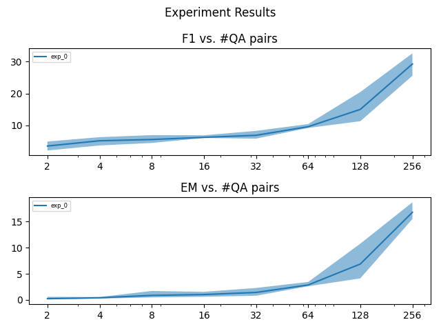

# thesis_public
Code to reproduce baseline expirement:
* Use roberta-base tokenizer and model
* Subsample n=[2,4,8,16,32,64,128,256] context-question-answer trios from squad1.1
* Train for with default Adam optimizer param
* Train matching scheme of Few-Shot Question Answering by Pretraining Span Selection https://arxiv.org/pdf/2101.00438.pdf
  * Choosing max(200 steps, 10 epochs), a step is one batch update
* Results are saved into the `results` folder

Examples for results can be seen in the `base_res.csv` or the `base_plot.png`


To run:
```angular2html
git clone git@github.com:ednussi/thesis_public.git
cd thesis_public
python run_baseline.py
```

Notes:
* Script assumes you have a gpu
* On a Titan X expirement runs for ~6 hours
